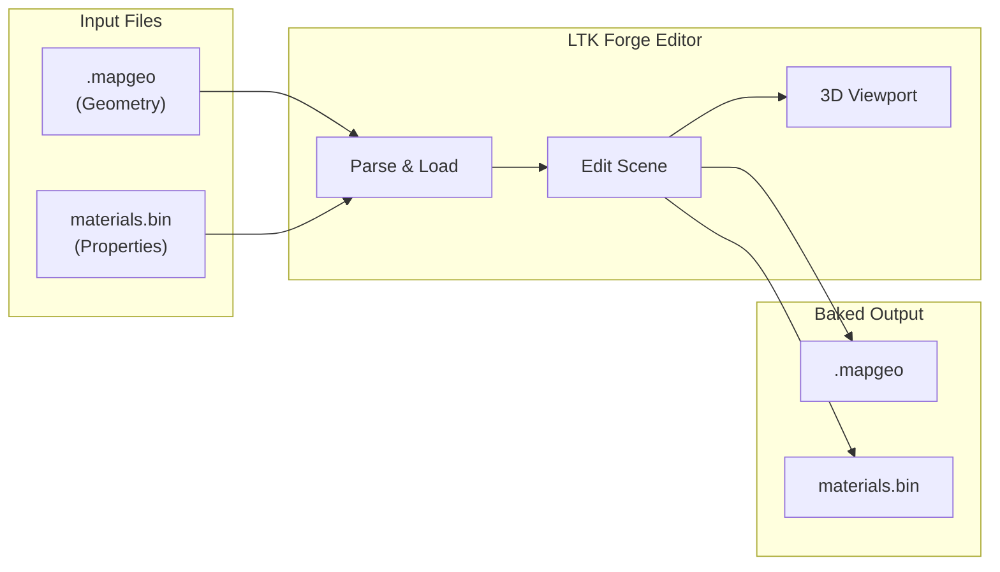
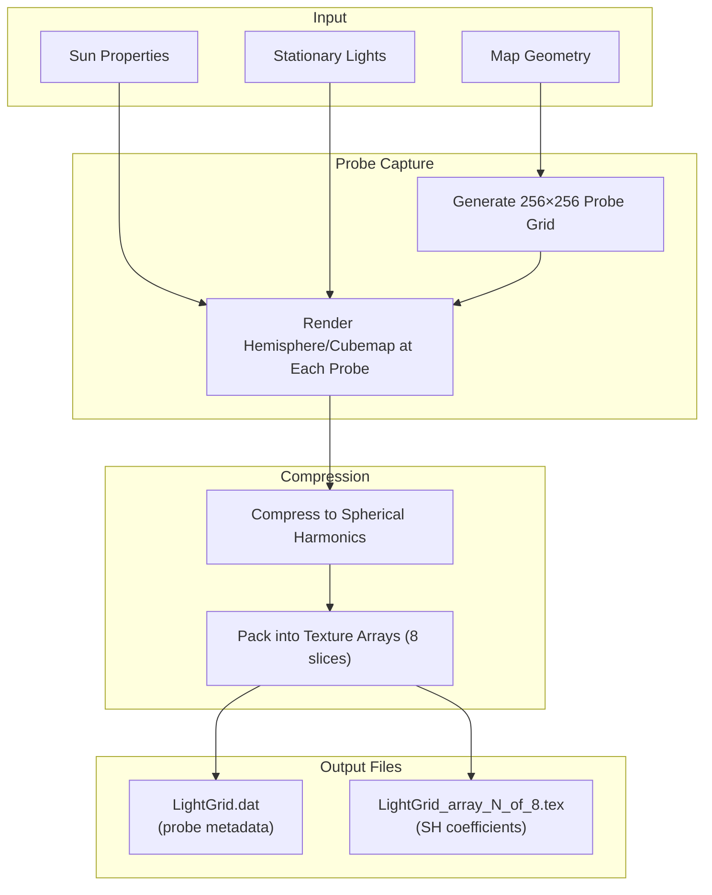
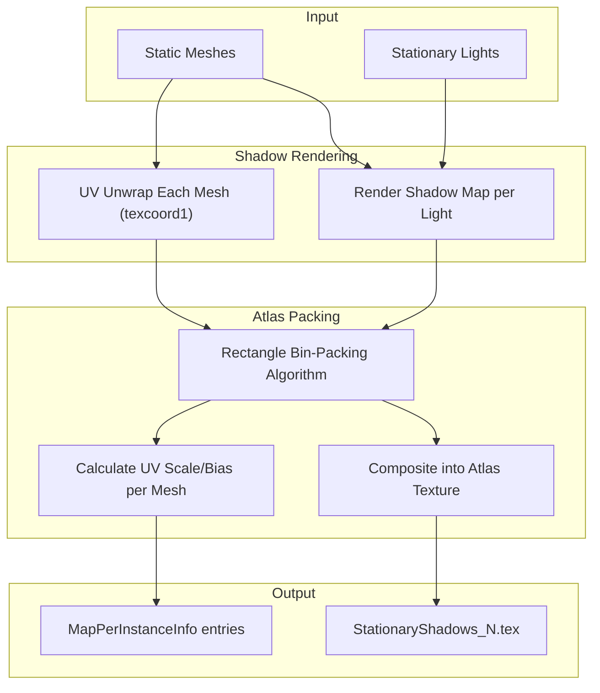

# LTK Forge - Design Document

> A visual editor for creating League of Legends mods

## Table of Contents

1. [Overview](#overview)
2. [Goals & Non-Goals](#goals--non-goals)
3. [Architecture](#architecture)
4. [Integration with Existing Tools](#integration-with-existing-tools)
5. [Core Features](#core-features)
6. [Editor Modules](#editor-modules)
7. [User Interface](#user-interface)
8. [Technical Specifications](#technical-specifications)
9. [Development Phases](#development-phases)
10. [Open Questions](#open-questions)

---

## Overview

**LTK Forge** is a visual editor application for creating and editing League of Legends mods. It provides a GUI-based workflow for tasks that currently require command-line tools, external 3D software, and manual file manipulation.

### Motivation

The current modding workflow has significant friction:

```
Current Workflow:
Extract (Obsidian) → Edit (Blender/Photoshop) → Convert (CLI) → Package (league-mod) → Test (Game)
                     ~~~~~~~~~~~~~~~~~~~~~~~~~~~~~~~~~~~~~~~~~~~~
                     Multiple tools, no live preview, slow iteration
```

Forge aims to consolidate the editing experience:

```
Forge Workflow:
Open Project → Edit (live preview) → Build → Test
               ~~~~~~~~~~~~~~~~~~~~
               Single tool, instant feedback
```

### Inspiration

- **Riot's Internal Tools**: Particle Town (VFX editor), internal map editors
- **Game Engines**: Unity, Unreal Editor, Godot
- **3D Software**: Blender's node-based materials, timeline

Reference: [Riot's Particle Town Article](https://nexus.leagueoflegends.com/en-us/2017/07/tech-kayn-goes-to-particle-town/)

---

## Goals & Non-Goals

### Goals

| Goal                       | Description                                        |
| -------------------------- | -------------------------------------------------- |
| **Live Preview**           | See changes immediately without launching the game |
| **Project-Based Workflow** | Work with `league-mod` project structure natively  |
| **Integrated Toolchain**   | Build mods directly from the editor                |
| **Accessible**             | Lower the barrier to entry for new modders         |
| **Extensible**             | Plugin/transformer system for custom workflows     |

### Non-Goals

| Non-Goal                 | Rationale                                                                 |
| ------------------------ | ------------------------------------------------------------------------- |
| **Full Game Recreation** | We approximate rendering, not replicate it exactly                        |
| **Gameplay Editing**     | Focus on assets, not game logic/scripting                                 |
| **Replace Blender**      | Complex modeling still done externally; we handle League-specific formats |
| **WAD Browser**          | Obsidian handles this; Forge focuses on editing                           |

---

## Architecture

### High-Level Overview

```
┌─────────────────────────────────────────────────────────────────────────────┐
│                              LTK FORGE                                      │
├─────────────────────────────────────────────────────────────────────────────┤
│                                                                             │
│  ┌───────────────────────────────────────────────────────────────────────┐ │
│  │                     FRONTEND (React + TypeScript)                      │ │
│  │                                                                        │ │
│  │  ┌─────────────┐ ┌─────────────┐ ┌─────────────┐ ┌─────────────────┐  │ │
│  │  │ Workstation │ │  Viewport   │ │  Inspector  │ │  Asset Browser  │  │ │
│  │  │    Shell    │ │  (Three.js) │ │   Panels    │ │                 │  │ │
│  │  └─────────────┘ └─────────────┘ └─────────────┘ └─────────────────┘  │ │
│  │                                                                        │ │
│  │  ┌─────────────────────────────────────────────────────────────────┐  │ │
│  │  │  League Renderers: Map | Skinned Mesh | Static Mesh | Particles │  │ │
│  │  └─────────────────────────────────────────────────────────────────┘  │ │
│  └────────────────────────────────────┬──────────────────────────────────┘ │
│                                       │ Tauri IPC                          │
│  ┌────────────────────────────────────┴──────────────────────────────────┐ │
│  │                       BACKEND (Rust + Tauri)                           │ │
│  │                                                                        │ │
│  │  ┌────────────┐ ┌────────────┐ ┌────────────┐ ┌────────────────────┐  │ │
│  │  │  Project   │ │   Asset    │ │   Build    │ │  Editor Services   │  │ │
│  │  │  Manager   │ │  Resolver  │ │  Service   │ │  (Map, VFX, Mesh)  │  │ │
│  │  └────────────┘ └────────────┘ └────────────┘ └────────────────────┘  │ │
│  │                                                                        │ │
│  │  ┌─────────────────────────────────────────────────────────────────┐  │ │
│  │  │  league-toolkit crates | ltk_mod_project | league-mod (build)   │  │ │
│  │  └─────────────────────────────────────────────────────────────────┘  │ │
│  └───────────────────────────────────────────────────────────────────────┘ │
└─────────────────────────────────────────────────────────────────────────────┘
```

### Technology Stack

| Layer                | Technology                    | Rationale                                       |
| -------------------- | ----------------------------- | ----------------------------------------------- |
| **Framework**        | Tauri 2.0                     | Native performance, Rust backend, small bundle  |
| **Frontend**         | React 18 + TypeScript         | Component model, ecosystem, type safety         |
| **3D Rendering**     | Three.js + @react-three/fiber | WebGL, React integration, mature ecosystem      |
| **UI Components**    | Radix UI + Tailwind           | Accessible primitives, utility-first styling    |
| **State Management** | Zustand + Immer               | Lightweight, immutable updates for undo/redo    |
| **Layout**           | Allotment / react-mosaic      | Resizable panels, dockable windows              |
| **Backend**          | Rust                          | Performance, memory safety, shared with ltk\_\* |

### Data Flow

```
┌─────────────┐     ┌─────────────┐     ┌─────────────┐     ┌─────────────┐
│   User      │     │  Frontend   │     │   Backend   │     │  File       │
│   Action    │────▶│   State     │────▶│   Command   │────▶│  System     │
└─────────────┘     └─────────────┘     └─────────────┘     └─────────────┘
                           │                   │
                           │                   │
                           ▼                   ▼
                    ┌─────────────┐     ┌─────────────┐
                    │  Three.js   │     │  ltk_*      │
                    │  Viewport   │     │  Crates     │
                    └─────────────┘     └─────────────┘
```

---

## Integration with Existing Tools

### LeagueToolkit Ecosystem

```
┌─────────────────────────────────────────────────────────────────────────────┐
│                         LEAGUETOOLKIT ECOSYSTEM                             │
├─────────────────────────────────────────────────────────────────────────────┤
│                                                                             │
│   ┌─────────────────────────────────────────────────────────────────────┐  │
│   │                         league-toolkit                               │  │
│   │            (Core parsing: WAD, mesh, animation, texture)             │  │
│   └─────────────────────────────────────────────────────────────────────┘  │
│                    ▲                           ▲                            │
│                    │ uses                      │ uses                       │
│   ┌────────────────┴───────────┐   ┌──────────┴────────────────────────┐  │
│   │         league-mod          │   │           LTK Forge               │  │
│   │       (CLI Build Tool)      │◀──│        (Visual Editor)            │  │
│   │                             │   │                                   │  │
│   │  $ league-mod init          │   │  Invokes league-mod for builds    │  │
│   │  $ league-mod pack          │   │  Shares ltk_mod_project format    │  │
│   └─────────────────────────────┘   └───────────────────────────────────┘  │
│                    ▲                           ▲                            │
│                    │ uses                      │ uses                       │
│                    └───────────┬───────────────┘                            │
│                                │                                            │
│   ┌────────────────────────────┴────────────────────────────────────────┐  │
│   │                        ltk_mod_project                               │  │
│   │                   (Shared Project Format)                            │  │
│   └─────────────────────────────────────────────────────────────────────┘  │
│                                                                             │
│   ┌─────────────────────────────────────────────────────────────────────┐  │
│   │                          Obsidian                                    │  │
│   │                    (WAD Browser/Previewer)                           │  │
│   │                                                                      │  │
│   │   Context menu: "Edit in Forge" ─────────────────────────────────▶   │  │
│   └─────────────────────────────────────────────────────────────────────┘  │
│                                                                             │
└─────────────────────────────────────────────────────────────────────────────┘
```

### Shared Project Format

Forge uses the same `mod.config.toml` as `league-mod`:

```toml
# mod.config.toml - Read/written by both Forge and league-mod CLI

name = "old-summoners-rift"
display_name = "Old Summoners Rift"
version = "0.1.0"
description = "Restores the classic Summoner's Rift map"

authors = [
    "Crauzer",
    { name = "TheKillerey", role = "Textures" }
]

[[layers]]
name = "base"
priority = 0
description = "Base layer of the mod"

[[layers]]
name = "high_res"
priority = 10
description = "4K texture pack"

[[transformers]]
name = "tex-converter"
patterns = ["**/*.png", "**/*.dds"]

[transformers.options]
format = "bc3"
mipmaps = true
```

### Asset Resolution

Forge resolves assets by checking layers (priority order) then falling back to game files:

```
Asset Request: "data/maps/mapgeometry/sr/base.mapgeo"

1. Check layers/high_res/data/maps/...  (priority 10)  → Not found
2. Check layers/base/data/maps/...      (priority 0)   → FOUND ✓
   └── Return: Modified version from project

--- OR if not in any layer ---

3. Check game WADs                                      → FOUND ✓
   └── Return: Original game asset
```

### Build Integration

Forge invokes `league-mod` for builds:

```rust
// Option A: Shell out to CLI
Command::new("league-mod")
    .args(["pack", "--config-path", project_path])
    .spawn()?;

// Option B: Use shared library (if extracted)
league_mod_core::pack(config, options)?;
```

---

## Core Features

### 1. Project Management

| Feature          | Description                           |
| ---------------- | ------------------------------------- |
| Create Project   | Initialize new mod project via wizard |
| Open Project     | Load existing `mod.config.toml`       |
| Project Settings | Edit metadata, layers, transformers   |
| Recent Projects  | Quick access to recent work           |
| Game Path Config | Configure League installation path    |

### 2. Asset Browser

| Feature      | Description                               |
| ------------ | ----------------------------------------- |
| Layer View   | Browse files organized by layer           |
| Game Assets  | Browse original game files (read-only)    |
| Search       | Find assets by path or hash               |
| Preview      | Quick preview thumbnails                  |
| Context Menu | Open in editor, show in folder, copy path |

### 3. Asset Resolution

| Feature             | Description                                |
| ------------------- | ------------------------------------------ |
| Layer Priority      | Higher priority layers override lower      |
| Game Fallback       | Use original game assets if not overridden |
| Conflict Detection  | Warn when multiple layers modify same file |
| Dependency Tracking | Track which files reference which          |

### 4. Build System

| Feature        | Description                        |
| -------------- | ---------------------------------- |
| Build Project  | Invoke `league-mod pack`           |
| Build Output   | Show build log, errors, warnings   |
| Hot Reload     | Rebuild on file changes (optional) |
| Export Formats | .modpkg, .fantome, raw WAD overlay |

### 5. Undo/Redo

| Feature         | Description                        |
| --------------- | ---------------------------------- |
| Command Pattern | All edits are reversible commands  |
| History Panel   | View and navigate edit history     |
| Per-Document    | Each open file has its own history |

---

## Editor Modules

### Map Editor

**Purpose**: Edit `.mapgeo` environment files

```
┌─────────────────────────────────────────────────────────────────────────────┐
│  Map Editor                                                                 │
├────────────────┬────────────────────────────────────┬───────────────────────┤
│   Layers       │         3D Viewport                │    Inspector          │
│                │                                    │                       │
│  📁 Terrain    │   ┌──────────────────────────┐     │  Transform            │
│   └─ base_01   │   │                          │     │  ├─ Position: X Y Z   │
│   └─ grass_02  │   │     [Rendered Map]       │     │  ├─ Rotation: X Y Z   │
│  📁 Props      │   │                          │     │  └─ Scale: X Y Z      │
│   └─ tree_001  │   │     [Selection Box]      │     │                       │
│   └─ rock_003  │   │                          │     │  Material             │
│                │   └──────────────────────────┘     │  └─ path/to/mat.bin   │
│                │                                    │                       │
│                │   [Move][Rotate][Scale] [Grid:On]  │  Visibility           │
│                │                                    │  └─ Flags: [✓][✓][ ]  │
├────────────────┴────────────────────────────────────┴───────────────────────┤
│  Scene Hierarchy                                                            │
│  ▼ SR_Base                                                                  │
│    ├─ terrain_base_mesh                                                     │
│    ├─ grass_patch_001                                                       │
│    └─ ▼ props                                                               │
│        ├─ tree_large_001                                                    │
│        └─ rock_medium_003                                                   │
└─────────────────────────────────────────────────────────────────────────────┘
```

**Capabilities**:

| Feature              | Description                                         |
| -------------------- | --------------------------------------------------- |
| View Map             | Load and render `.mapgeo` files                     |
| Select Meshes        | Click to select, multi-select with Shift            |
| Transform            | Move, rotate, scale with gizmos                     |
| Edit Properties      | Visibility flags, material, lightmap                |
| Bucket Visualization | Debug view of spatial bucketing                     |
| Add/Remove Meshes    | Insert props, delete geometry                       |
| Save                 | Write modified `.mapgeo` + `materials.bin` to layer |

#### Map Data Architecture

A League map consists of two primary files:

| File            | Purpose                                                                          |
| --------------- | -------------------------------------------------------------------------------- |
| `.mapgeo`       | Binary 3D geometry (vertices, indices, UV mappings, transforms, spatial buckets) |
| `materials.bin` | Serialized map data (materials, map objects, components, properties)             |

The `materials.bin` file uses the property bin format and contains a [`MapContainer`](https://meta-wiki.leaguetoolkit.dev/classes/mapcontainer/) as its main entry point:

```
MapContainer
├── mapPath: string              # Path to .mapgeo file
├── boundsMin/Max: vec2          # World space bounds
├── lowestWalkableHeight: f32    # Navigation floor
├── components: List<MapComponent>
│   ├── MapBakeProperties        # Lightmap paths, shadow UV atlas
│   ├── MapNavGrid               # AI navigation grid
│   ├── MapSunProperties         # Sun direction, colors, fog
│   ├── MapLightingV2            # Lighting parameters
│   ├── MapTerrainPaint          # Terrain splat texture
│   └── MapMinimap               # Minimap texture path
└── chunks: Map<Hash, MapPlaceableContainer>
    ├── "Default"                # Main geometry chunk
    ├── "Ground"                 # Terrain
    ├── "Plants"                 # Foliage
    ├── "Particles"              # VFX placements
    ├── "Locators"               # Spawn points, markers
    └── "Audio"                  # Audio regions
```

See: [MapComponent](https://meta-wiki.leaguetoolkit.dev/classes/mapcomponent/) | [MapPlaceableBase](https://meta-wiki.leaguetoolkit.dev/classes/mapplaceablebase/)

**Example from Brawl (Map35)**:

```
"Maps/MapGeometry/Map35/Base" = MapContainer {
    mapPath: string = "Maps/MapGeometry/Map35/Base"
    boundsMax: vec2 = { 7000, 7000 }
    lowestWalkableHeight: f32 = -100

    components: [
        MapBakeProperties {
            lightGridSize: u32 = 256
            lightGridFileName: "ASSETS/Maps/Lightmaps/.../LightGrid.Brawl_CubemapProbe.dat"
            // Per-mesh shadow map UV scale/bias mappings
        }
        MapNavGrid {
            NavGridPath: "ASSETS/Maps/NavGrid/Map35/AIPATH_BRAWL.aimesh_ngrid"
        }
        MapSunProperties {
            sunColor: { 1, 0.956, 0.786, 1 }
            sunDirection: { -0.217, 0.790, 0.574 }
            fogColor: { 0.598, 0.879, 0.943, 1 }
        }
        MapTerrainPaint {
            TerrainPaintTexturePath: "ASSETS/Maps/TerrainPaint/.../Base.Brawl.png"
        }
        MapMinimap {
            texturePath: "ASSETS/Maps/Info/Map35/Minimap7.Brawl.tex"
        }
    ]

    chunks: {
        "Default"   -> MapPlaceableContainer  // Main static geometry
        "Ground"    -> MapPlaceableContainer  // Terrain meshes
        "Plants"    -> MapPlaceableContainer  // Foliage
        "Particles" -> MapPlaceableContainer  // VFX placements
        "Locators"  -> MapPlaceableContainer  // Spawn/objective markers
        "Audio"     -> MapPlaceableContainer  // Audio regions
    }
}
```

#### Forge Map Workflow



**Technical Notes**:

- Requires mapgeo parser (see [Issue #85](https://github.com/LeagueToolkit/league-toolkit/issues/85))
- Requires `ltk_ritobin` for parsing `materials.bin` property bin files
- Bucketed geometry is read-only visualization (regenerated on save)
- Materials are defined in `materials.bin` and referenced by hash from meshes
- Chunks organize map content into logical groups (terrain, props, particles, etc.)
- Components define global map properties (lighting, navigation, minimap)

#### Lightmap Baking

When modifying map geometry or lighting, lightmaps must be re-baked to produce correct in-game visuals. Forge aims to provide a lightmap baking pipeline that generates game-compatible output.

**Baked Lighting Components**:

| Component               | Description                                                 | Output                           |
| ----------------------- | ----------------------------------------------------------- | -------------------------------- |
| **Light Grid**          | 3D grid of lighting probes for dynamic objects (characters) | `LightGrid.dat` + texture arrays |
| **Shadow Atlas**        | Baked shadows from stationary lights, packed per-mesh       | `StationaryShadows_N.tex`        |
| **Per-Mesh UV Mapping** | Scale/bias to map mesh UVs to shadow atlas regions          | `MapPerInstanceInfo` in `.bin`   |

**Light Grid Baking Pipeline**:



**Shadow Atlas Baking Pipeline**:



**MapPerInstanceInfo Output Format**:

```
0xa300dcea = MapPerInstanceInfo {
    shadowMapPath: "ASSETS/Maps/Lightmaps/.../StationaryShadows_0.tex"
    shadowMapUVScaleAndBias: vec4 = { scale_x, scale_y, bias_x, bias_y }
}
```

The `shadowMapUVScaleAndBias` transforms mesh UV coordinates to atlas coordinates:

- `scale_xy`: Size of mesh's region in atlas (0.0-1.0)
- `bias_xy`: Offset/position in atlas (0.0-1.0)

**Implementation Approach**:

| Phase                    | Approach                                    | Notes                                  |
| ------------------------ | ------------------------------------------- | -------------------------------------- |
| **Phase 1: Import Only** | Read existing baked data, display in editor | No re-baking, read-only lightmaps      |
| **Phase 2: CPU Baking**  | Software raytracer for light grid + shadows | Slow but portable, good for small maps |
| **Phase 3: GPU Baking**  | WebGPU/wgpu compute shaders                 | Fast, handles full SR-sized maps       |

**CPU Baking (Phase 2)**:

```rust
// Pseudocode for light grid baking
fn bake_light_grid(map: &Map, settings: &BakeSettings) -> LightGrid {
    let grid_size = 256;
    let cell_size = map.bounds.size() / grid_size as f32;

    let mut probes = Vec::with_capacity(grid_size * grid_size);

    for z in 0..grid_size {
        for x in 0..grid_size {
            let world_pos = map.bounds.min + Vec3::new(
                x as f32 * cell_size.x,
                0.0, // Sample at ground level
                z as f32 * cell_size.z,
            );

            // Trace rays in hemisphere above probe
            let sh_coeffs = trace_hemisphere_to_sh(
                world_pos,
                &map.geometry,
                &settings.sun,
                &settings.sky_color,
            );

            probes.push(LightProbe { position: world_pos, sh: sh_coeffs });
        }
    }

    LightGrid::from_probes(probes)
}
```

**Shadow Atlas Packing**:

```rust
// Pseudocode for shadow atlas packing
fn pack_shadow_atlas(meshes: &[Mesh], atlas_size: u32) -> ShadowAtlas {
    // Sort meshes by shadow map area (largest first)
    let mut sorted: Vec<_> = meshes.iter()
        .map(|m| (m, estimate_shadow_area(m)))
        .collect();
    sorted.sort_by(|a, b| b.1.cmp(&a.1));

    let mut packer = RectPacker::new(atlas_size, atlas_size);
    let mut atlas = ShadowAtlas::new(atlas_size);

    for (mesh, _) in sorted {
        if let Some(rect) = packer.pack(mesh.shadow_width, mesh.shadow_height) {
            // Render shadow map for this mesh
            let shadow = render_mesh_shadow(mesh, &lights);
            atlas.blit(shadow, rect);

            // Calculate UV transform
            atlas.set_uv_mapping(mesh.name_hash, UvMapping {
                scale: Vec2::new(
                    rect.width as f32 / atlas_size as f32,
                    rect.height as f32 / atlas_size as f32,
                ),
                bias: Vec2::new(
                    rect.x as f32 / atlas_size as f32,
                    rect.y as f32 / atlas_size as f32,
                ),
            });
        }
    }

    atlas
}
```

**Bake Settings UI**:

```
┌─────────────────────────────────────────────────────────────────────────────┐
│  Lightmap Baking                                                            │
├─────────────────────────────────────────────────────────────────────────────┤
│                                                                             │
│  Light Grid                           Shadow Atlas                          │
│  ──────────                           ────────────                          │
│  Grid Size:     [256 ▼]               Atlas Size:     [2048 ▼]             │
│  Sample Count:  [64  ▼]               Padding:        [2    ] px           │
│  Bounce Count:  [2   ▼]               Filter Radius:  [1.0  ]              │
│                                                                             │
│  Sun Settings (from MapSunProperties)                                       │
│  ────────────────────────────────────                                       │
│  Direction:     [-0.217, 0.790, 0.574]  [Pick from Scene]                  │
│  Color:         [████████] #FFF4C8                                          │
│  Intensity:     [0.2    ]                                                   │
│  Shadow Radius: [5.0    ]                                                   │
│                                                                             │
│  ┌───────────────────────────────────────────────────────────────────────┐ │
│  │ Preview: [Light Grid ▼]                                                │ │
│  │                                                                        │ │
│  │  ┌──────────────────────────────────────────────────────────────────┐ │ │
│  │  │                                                                  │ │ │
│  │  │     [3D viewport with probe visualization / shadow preview]     │ │ │
│  │  │                                                                  │ │ │
│  │  └──────────────────────────────────────────────────────────────────┘ │ │
│  └───────────────────────────────────────────────────────────────────────┘ │
│                                                                             │
│  Output: /layers/base/ASSETS/Maps/Lightmaps/...                             │
│                                                                             │
│  [Bake Light Grid]  [Bake Shadows]  [Bake All]          Progress: [██████░░] │
│                                                                             │
└─────────────────────────────────────────────────────────────────────────────┘
```

**Output Files Generated**:

```
layers/base/ASSETS/Maps/Lightmaps/Maps/MapGeometry/{MapName}/Base/
├── LightGrid.{Variant}_CubemapProbe.dat
├── LightGrid_array_1_of_8.{Variant}_CubemapProbe.tex
├── LightGrid_array_2_of_8.{Variant}_CubemapProbe.tex
├── ... (up to 8)
├── StationaryShadows_0.{Variant}.tex
└── StationaryShadows_1.{Variant}.tex (if needed)
```

Plus `MapBakeProperties` entries in `materials.bin`:

- `lightGridFileName`, `RmaStaticLightGridTexturePath`
- `MapPerInstanceInfo` per mesh with shadow UV mappings
- `StationaryLightChannelAssignments`

**Open Questions for Lightmap Baking**:

1. **Accuracy vs Speed**: How close to Riot's baking do we need to be?
2. **GPU Backend**: Use wgpu for compute, or leverage Three.js WebGL for preview-quality?
3. **Incremental Baking**: Re-bake only affected probes when geometry changes?
4. **Light Grid Format**: Reverse-engineer exact `.dat` format

### VFX/Particle Editor

**Purpose**: Preview and edit particle systems

```
┌─────────────────────────────────────────────────────────────────────────────┐
│  VFX Editor                                                                 │
├────────────────┬──────────────────────────┬─────────────────────────────────┤
│   System       │      Preview Viewport    │      Properties                 │
│   Tree         │                          │                                 │
│                │   ┌──────────────────┐   │   Emitter: burst_core           │
│  ▼ Lux_R       │   │                  │   │   ─────────────────────         │
│    ├─ burst    │   │   [Live VFX      │   │   Birth Rate    [~~~~]          │
│    ├─ glow     │   │    Preview]      │   │   Lifetime      0.5 - 1.2       │
│    ├─ trail    │   │                  │   │   Start Size    [~~~~]          │
│    └─ impact   │   │                  │   │   Start Color   [Gradient]      │
│                │   └──────────────────┘   │   Velocity       [Vector3]      │
│  [+ Emitter]   │                          │   Texture        spark.dds      │
│                │   [▶ Play] [Speed: 1x]   │                                 │
├────────────────┴──────────────────────────┴─────────────────────────────────┤
│  Curve Editor                                                               │
│  ┌──────────────────────────────────────────────────────────────────────┐  │
│  │  1.0 ┤      ╭──────╮                      Property: [Scale ▼]        │  │
│  │      │     ╱        ╲                                                │  │
│  │  0.5 ┤   ╱            ╲                   [Add Key] [Delete Key]     │  │
│  │      │ ╱                ╲                                            │  │
│  │  0.0 ┼─────────────────────────                                      │  │
│  │      0.0              0.5              1.0                           │  │
│  └──────────────────────────────────────────────────────────────────────┘  │
└─────────────────────────────────────────────────────────────────────────────┘
```

**Capabilities**:

| Feature           | Description                            |
| ----------------- | -------------------------------------- |
| Load VFX          | Parse particle definitions from `.bin` |
| Live Preview      | Real-time particle simulation          |
| Edit Properties   | Birth rate, lifetime, velocity, etc.   |
| Curve Editor      | Edit value-over-lifetime curves        |
| Gradient Editor   | Edit color gradients                   |
| Playback Controls | Play, pause, speed, scrub timeline     |
| Save              | Write modified particle definition     |

**Technical Notes**:

- Particle definitions stored in `.bin` (property bin format)
- Requires `ltk_ritobin` for parsing
- GPU-based particle rendering in Three.js
- Curves use League's custom interpolation format

### Model Viewer

**Purpose**: View and inspect skinned/static meshes

```
┌─────────────────────────────────────────────────────────────────────────────┐
│  Model Viewer                                                               │
├────────────────┬──────────────────────────┬─────────────────────────────────┤
│   Assets       │         Viewport         │      Properties                 │
│                │                          │                                 │
│  📁 Champions  │   ┌──────────────────┐   │   Model Info                    │
│   └─ Ahri      │   │                  │   │   ├─ Vertices: 12,450           │
│   └─ Lux       │   │   [Skinned Mesh  │   │   ├─ Triangles: 8,234           │
│   └─ Kayn      │   │    + Skeleton]   │   │   ├─ Bones: 67                  │
│                │   │                  │   │   └─ Submeshes: 3               │
│  📁 Skins      │   │                  │   │                                 │
│   └─ Base      │   └──────────────────┘   │   Materials                     │
│   └─ Prestige  │                          │   ├─ body_mat                   │
│                │   [Orbit] [Pan] [Zoom]   │   └─ weapon_mat                 │
├────────────────┼──────────────────────────┴─────────────────────────────────┤
│   Animations   │                      Timeline                              │
│                │   ┌────────────────────────────────────────────────────┐  │
│  ▶ Idle        │   │ [▶][⏸][◀◀][▶▶]  0:00 ════●════════════════ 2:30   │  │
│    Run         │   │                                                    │  │
│    Attack1     │   │  [Keyframe visualization]                          │  │
│    Dance       │   └────────────────────────────────────────────────────┘  │
└────────────────┴────────────────────────────────────────────────────────────┘
```

**Capabilities**:

| Feature            | Description                              |
| ------------------ | ---------------------------------------- |
| Load Models        | `.skn` (skinned), `.scb`/`.sco` (static) |
| Load Skeleton      | `.skl` skeleton files                    |
| Load Animations    | `.anm` animation files                   |
| Playback           | Play, pause, scrub animations            |
| Bone Visualization | Show skeleton overlay                    |
| Material Preview   | Basic material rendering                 |
| Export             | Export to glTF/glb for external tools    |

**Technical Notes**:

- Uses `ltk_mesh` for skinned/static mesh parsing
- Uses `ltk_anim` for animation evaluation
- Skeleton hierarchy visualization
- Basic PBR material approximation

### Texture Viewer

**Purpose**: Preview texture assets

**Capabilities**:

| Feature       | Description                     |
| ------------- | ------------------------------- |
| View Textures | `.tex`, `.dds`, `.png`          |
| Channel View  | RGB, R, G, B, Alpha individual  |
| Mipmap View   | View different mip levels       |
| Metadata      | Format, dimensions, compression |

---

## User Interface

### Workstation Layout

The UI follows a workstation/IDE paradigm with dockable panels:

```
┌─────────────────────────────────────────────────────────────────────────────┐
│  LTK Forge                                    [─][□][×]                     │
├─────────────────────────────────────────────────────────────────────────────┤
│  File  Edit  View  Project  Build  Help                                     │
├─────────────────────────────────────────────────────────────────────────────┤
│  [🗺 Map] [✨ VFX] [🧍 Model] [🖼 Texture]    project: old-summoners-rift   │
├────────────────┬────────────────────────────────────────┬───────────────────┤
│                │                                        │                   │
│   Asset        │              Main Viewport             │    Inspector      │
│   Browser      │                                        │                   │
│                │   ┌────────────────────────────────┐   │   [Properties]    │
│   [Layers ▼]   │   │                                │   │                   │
│                │   │                                │   │   Transform       │
│   📁 base      │   │        [3D Scene]              │   │   ─────────       │
│    └─ data/    │   │                                │   │   X: 0.00         │
│   📁 high_res  │   │                                │   │   Y: 0.00         │
│    └─ data/    │   │                                │   │   Z: 0.00         │
│                │   │                                │   │                   │
│   ─────────    │   └────────────────────────────────┘   │                   │
│   📁 Game      │                                        │                   │
│    └─ WADs     │   [Tool: Select ▼] [Gizmo: Local ▼]   │                   │
│                │                                        │                   │
├────────────────┴────────────────────────────────────────┴───────────────────┤
│  Console    Scene Hierarchy    Timeline    History                          │
│  ────────────────────────────────────────────────────────────────────────── │
│  [14:32:01] Project loaded: old-summoners-rift                              │
│  [14:32:02] Loaded 156 assets from base layer                               │
│  [14:32:15] Selected: terrain_base_001                                      │
└─────────────────────────────────────────────────────────────────────────────┘
```

### Theme

- **Dark theme** by default (matches typical 3D software)
- Accent color: League gold (#C89B3C) or custom
- Monospace font for technical data
- Clear visual hierarchy

### Keyboard Shortcuts

| Action           | Shortcut     |
| ---------------- | ------------ |
| Save             | Ctrl+S       |
| Undo             | Ctrl+Z       |
| Redo             | Ctrl+Shift+Z |
| Delete           | Delete       |
| Duplicate        | Ctrl+D       |
| Focus Selection  | F            |
| Toggle Wireframe | Z            |
| Build Project    | Ctrl+B       |

---

## Technical Specifications

### Project Structure

```
forge/
├── src-tauri/
│   ├── Cargo.toml
│   ├── tauri.conf.json
│   ├── capabilities/
│   └── src/
│       ├── main.rs
│       ├── lib.rs
│       ├── commands/           # Tauri command handlers
│       │   ├── mod.rs
│       │   ├── project.rs      # Project management
│       │   ├── asset.rs        # Asset loading
│       │   ├── map.rs          # Map editor commands
│       │   ├── vfx.rs          # VFX editor commands
│       │   ├── mesh.rs         # Mesh viewer commands
│       │   └── build.rs        # Build system
│       ├── services/           # Business logic
│       │   ├── mod.rs
│       │   ├── project_manager.rs
│       │   ├── asset_resolver.rs
│       │   ├── wad_index.rs
│       │   └── file_watcher.rs
│       └── state/              # Application state
│           ├── mod.rs
│           └── app_state.rs
│
├── src/
│   ├── main.tsx
│   ├── App.tsx
│   ├── components/
│   │   ├── Workstation/        # Shell, menus, panels
│   │   ├── Viewport/           # Three.js canvas
│   │   ├── Inspector/          # Property editors
│   │   ├── AssetBrowser/       # File tree
│   │   ├── Timeline/           # Animation timeline
│   │   ├── CurveEditor/        # VFX curve editing
│   │   └── Console/            # Log output
│   ├── editors/
│   │   ├── MapEditor/
│   │   ├── VFXEditor/
│   │   ├── ModelViewer/
│   │   └── TextureViewer/
│   ├── renderers/              # Three.js rendering
│   │   ├── MapRenderer.ts
│   │   ├── SkinnedMeshRenderer.ts
│   │   ├── ParticleRenderer.ts
│   │   └── materials/
│   ├── stores/                 # Zustand stores
│   │   ├── projectStore.ts
│   │   ├── selectionStore.ts
│   │   ├── viewportStore.ts
│   │   └── historyStore.ts
│   ├── hooks/
│   │   ├── useTauriCommand.ts
│   │   ├── useAsset.ts
│   │   └── useViewport.ts
│   └── lib/
│       ├── types.ts            # TypeScript types
│       └── constants.ts
│
├── package.json
├── tsconfig.json
├── tailwind.config.js
└── vite.config.ts
```

### Dependencies

#### Backend (Rust)

```toml
[dependencies]
# Tauri
tauri = { version = "2", features = ["shell-open", "dialog"] }
tauri-plugin-dialog = "2"
tauri-plugin-shell = "2"

# Serialization
serde = { version = "1", features = ["derive"] }
serde_json = "1"
toml = "0.8"

# Async
tokio = { version = "1", features = ["full"] }

# League Toolkit (local paths or git)
ltk_wad = { path = "../league-toolkit/crates/ltk_wad" }
ltk_mesh = { path = "../league-toolkit/crates/ltk_mesh" }
ltk_anim = { path = "../league-toolkit/crates/ltk_anim" }
ltk_texture = { path = "../league-toolkit/crates/ltk_texture" }
ltk_file = { path = "../league-toolkit/crates/ltk_file" }
ltk_hash = { path = "../league-toolkit/crates/ltk_hash" }
ltk_ritobin = { path = "../league-toolkit/crates/ltk_ritobin" }
ltk_primitives = { path = "../league-toolkit/crates/ltk_primitives" }

# Mod Project
ltk_mod_project = { path = "../league-mod/crates/ltk_mod_project" }

# Utils
thiserror = "1"
tracing = "0.1"
walkdir = "2"
notify = "6"                    # File watching
```

#### Frontend (TypeScript)

```json
{
  "dependencies": {
    "@tauri-apps/api": "^2",
    "@tauri-apps/plugin-dialog": "^2",
    "@tauri-apps/plugin-shell": "^2",

    "react": "^18",
    "react-dom": "^18",

    "@react-three/fiber": "^8",
    "@react-three/drei": "^9",
    "three": "^0.160",

    "zustand": "^4",
    "immer": "^10",

    "@radix-ui/react-context-menu": "^2",
    "@radix-ui/react-dropdown-menu": "^2",
    "@radix-ui/react-tabs": "^1",
    "@radix-ui/react-tooltip": "^1",

    "allotment": "^1",
    "react-arborist": "^3",

    "tailwindcss": "^3",
    "clsx": "^2"
  },
  "devDependencies": {
    "@tauri-apps/cli": "^2",
    "typescript": "^5",
    "vite": "^5",
    "@vitejs/plugin-react": "^4"
  }
}
```

### IPC Protocol

Commands follow a request/response pattern:

```typescript
// Frontend calls
const mapData = await invoke<MapData>('load_map', {
  path: 'data/maps/mapgeometry/sr/base.mapgeo'
});

// Backend handler
#[tauri::command]
async fn load_map(
    path: String,
    state: State<'_, AppState>
) -> Result<MapData, String> {
    let resolved = state.resolver.resolve(&path)?;
    let asset = EnvironmentAsset::from_reader(&mut resolved.reader()?)?;
    Ok(convert_to_map_data(asset))
}
```

### Data Transfer Types

Binary data (geometry, textures) transferred efficiently:

```typescript
interface MapData {
  meshes: EnvironmentMesh[];
  sceneGraphs: BucketedGeometry[];
}

interface EnvironmentMesh {
  id: number;
  name: string;

  // ArrayBuffer for efficient transfer
  positions: ArrayBuffer; // Float32Array
  normals: ArrayBuffer;
  uvs: ArrayBuffer[];
  indices: ArrayBuffer; // Uint16Array

  boundingBox: AABB;
  materialPath: string;
  visibility: number;
}
```

---

## Development Phases

### Phase 1: Foundation (MVP)

**Goal**: Basic project management and model viewing

- [ ] Tauri project setup
- [ ] Project loading (`mod.config.toml`)
- [ ] Asset browser (layer view)
- [ ] Game path configuration
- [ ] Model viewer (`.skn` + `.skl`)
- [ ] Basic 3D viewport with orbit controls

**Deliverable**: Can open project, browse assets, view champion models

### Phase 2: Animation & Textures

**Goal**: Complete model viewing experience

- [ ] Animation playback (`.anm`)
- [ ] Animation timeline
- [ ] Texture viewer (`.tex`, `.dds`)
- [ ] Static mesh support (`.scb`, `.sco`)
- [ ] Material preview (basic)

**Deliverable**: Full model/animation inspection

### Phase 3: Map Viewer

**Goal**: View map geometry

- [ ] MapGeometry parser integration (Issue #85)
- [ ] Map rendering in viewport
- [ ] Mesh selection (click to select)
- [ ] Property inspector (read-only)
- [ ] Bucket visualization (debug)

**Deliverable**: Can view and navigate League maps

### Phase 4: Map Editor

**Goal**: Edit map geometry

- [ ] Transform gizmos (move/rotate/scale)
- [ ] Property editing
- [ ] Undo/redo system
- [ ] Save to layer
- [ ] Add/remove meshes

**Deliverable**: Can modify and save map changes

### Phase 5: Lightmap Baking

**Goal**: Re-bake lighting when geometry/lighting changes

- [ ] Light grid probe visualization
- [ ] Shadow atlas preview
- [ ] CPU-based light grid baking (software raytracer)
- [ ] Shadow atlas packing algorithm
- [ ] MapBakeProperties generation
- [ ] Export to game-compatible format (.dat, .tex)
- [ ] Bake settings UI (grid size, sample count, sun settings)

**Deliverable**: Modified maps have correct baked lighting

### Phase 6: Build Integration

**Goal**: Seamless build workflow

- [ ] Invoke `league-mod pack`
- [ ] Build output panel
- [ ] Error display
- [ ] Hot reload (optional)

**Deliverable**: Build mods directly from editor

### Phase 7: VFX Editor

**Goal**: Particle system editing

- [ ] Parse particle definitions from `.bin`
- [ ] Particle renderer (GPU-based)
- [ ] Property editor
- [ ] Curve editor
- [ ] Gradient editor
- [ ] Save particle definitions

**Deliverable**: Create and edit VFX

### Phase 8: Polish & Advanced Features

- [ ] Multi-viewport layouts
- [ ] Plugin system
- [ ] Custom transformers UI
- [ ] Performance optimization
- [ ] Keyboard shortcut customization
- [ ] Themes

---

## Open Questions

### Technical

1. **Material Rendering**: How accurately should we replicate League's shaders?
   - Option A: Simplified PBR approximation
   - Option B: Custom shaders matching League's pipeline
2. **Large Map Performance**: How to handle maps with thousands of meshes?
   - LOD system?
   - Frustum culling in editor?
   - Progressive loading?

3. **VFX Simulation**: CPU or GPU particle simulation?
   - GPU: Better performance, complex to implement
   - CPU: Simpler, may be sufficient for preview

4. **Bucket Regeneration**: Should saving a map regenerate bucketed geometry?
   - If yes: Need to implement bucket generation algorithm
   - If no: Bucket visualization may not match actual game

### Workflow

1. **External Tool Integration**: Should Forge launch Blender/Photoshop?
   - "Edit externally" for complex modeling?
   - Watch for file changes and reload?

2. **Version Control**: Should Forge have Git integration?
   - Commit/push from editor?
   - Conflict resolution?

3. **Collaboration**: Multiple modders working on same project?
   - Asset locking?
   - Merge tooling?

### Scope

1. **Audio**: Should Forge handle audio preview/editing?
2. **Scripting**: Any support for gameplay-adjacent data?
3. **Champions**: Dedicated champion mod workflow?

---

## References

- [Riot's Particle Town Article](https://nexus.leagueoflegends.com/en-us/2017/07/tech-kayn-goes-to-particle-town/)
- [LeagueToolkit C# Reference](https://github.com/LeagueToolkit/LeagueToolkit)
- [league-toolkit Rust Crates](https://github.com/LeagueToolkit/league-toolkit)
- [league-mod CLI](https://github.com/LeagueToolkit/league-mod)
- [MapGeometry Issue #85](https://github.com/LeagueToolkit/league-toolkit/issues/85)
- [LoL Meta Wiki - Class Reference](https://meta-wiki.leaguetoolkit.dev/classes/mapcontainer/)
- [Tauri Documentation](https://tauri.app/)
- [React Three Fiber](https://docs.pmnd.rs/react-three-fiber)

---

_Document Version: 1.0_  
_Last Updated: December 2025_
