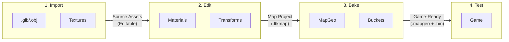
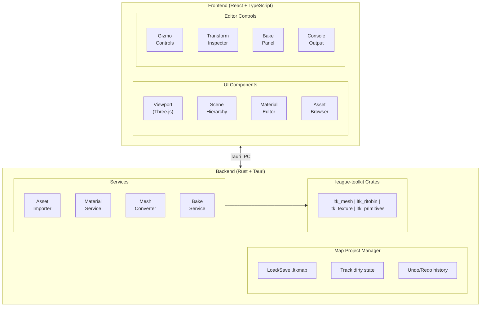
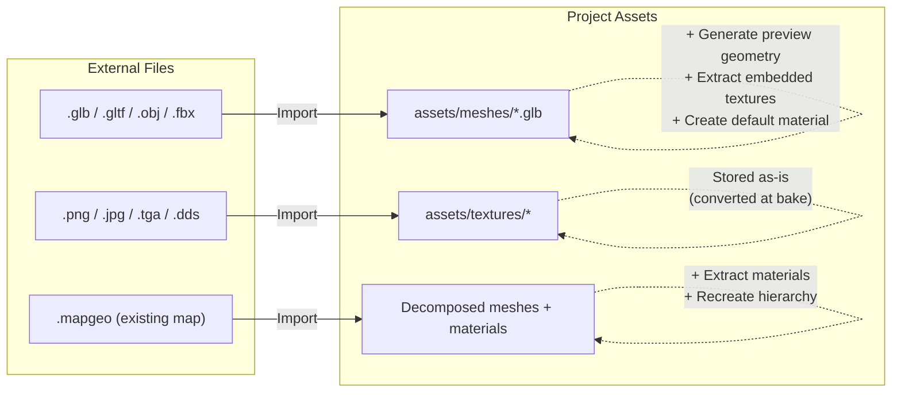
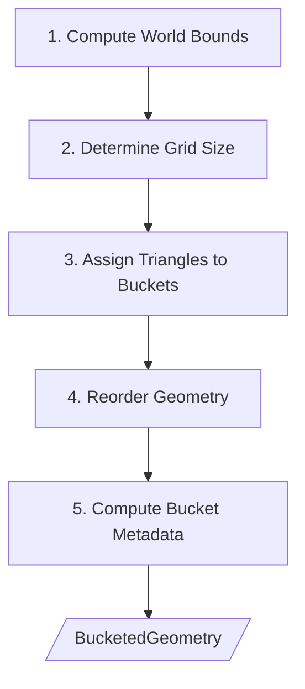

# LTK Forge - Map Editor Design Document

> Detailed design for the Map Editor module

## Table of Contents

1. [Overview](#overview)
2. [Architecture](#architecture)
3. [Project Format](#project-format)
4. [Asset Pipeline](#asset-pipeline)
5. [Editor Features](#editor-features)
6. [Material System](#material-system)
7. [VFX Integration](#vfx-integration)
8. [Map Objects](#map-objects)
9. [Baking System](#baking-system)
10. [Bucketed Geometry Generation](#bucketed-geometry-generation)
11. [Technical Implementation](#technical-implementation)

---

## Overview

The Map Editor allows users to create and modify League of Legends map geometry. Unlike simple mapgeo editing (modifying existing maps), this editor supports a full authoring workflow:



### Key Concepts

| Concept                     | Description                                                                                       |
| --------------------------- | ------------------------------------------------------------------------------------------------- |
| **Map Project**             | Source-of-truth project file (`.ltkmap`) containing all references and transforms                 |
| **Source Mesh**             | Imported 3D file (glb/obj/fbx) - editable, not game-ready                                         |
| **Static Environment Mesh** | Baked mesh in `.mapgeo` - terrain, rocks, static props (no runtime behavior)                      |
| **Map Object**              | Dynamic entity from `.bin` (MapPlaceable) - turrets, buildings, animated props (runtime behavior) |
| **Material Definition**     | `.bin` file describing shaders and textures                                                       |
| **Baking**                  | Process of converting project to game-ready `.mapgeo` + `.bin` files                              |

### Static vs Dynamic Content

| Aspect         | Static (Environment Meshes)   | Dynamic (Map Objects)            |
| -------------- | ----------------------------- | -------------------------------- |
| **Storage**    | `.mapgeo`                     | `.bin`                           |
| **Examples**   | Terrain, cliffs, rocks, trees | Turrets, inhibitors, shopkeepers |
| **Processing** | Baked, optimized, bucketed    | Loaded as game entities          |
| **Runtime**    | No changes                    | Can animate, die, respawn        |

---

## Architecture



---

## Project Format

### Map Project File (`.ltkmap`)

The map project is stored as a TOML file with accompanying asset directories:

```
my_custom_map/
├── map.ltkmap                    # Main project file
├── assets/
│   ├── meshes/                   # Imported source meshes
│   │   ├── terrain_base.glb
│   │   ├── rock_large.glb
│   │   └── tree_pine.glb
│   ├── textures/                 # Source textures
│   │   ├── grass_diffuse.png
│   │   ├── grass_normal.png
│   │   └── rock_diffuse.png
│   └── materials/                # Material definitions
│       ├── terrain_grass.material.toml
│       └── rock_mossy.material.toml
├── prefabs/                      # Reusable prefab definitions
│   ├── turret_order.prefab.toml
│   └── inhibitor.prefab.toml
├── vfx/                          # VFX placement references
│   └── ambient_particles.toml
└── build/                        # Bake output
    ├── base.mapgeo               # Static environment geometry
    ├── map_objects.bin           # Dynamic MapPlaceable objects
    ├── materials/
    │   └── *.bin                 # Material definitions
    └── textures/
        └── *.tex                 # Converted textures
```

### `map.ltkmap` Schema

```toml
[project]
name = "custom_summoners_rift"
display_name = "Custom Summoner's Rift"
version = "1.0.0"
author = "ModderName"
created = "2025-12-21T00:00:00Z"
modified = "2025-12-21T12:00:00Z"

# Target game map to base off (for fallback assets)
base_map = "sr"  # "sr", "ha", "tft", etc.

[settings]
# World bounds for bucket generation
world_min = [-8000.0, -500.0, -8000.0]
world_max = [8000.0, 500.0, 8000.0]

# Bucket settings
bucket_size = [512.0, 512.0]  # XZ bucket dimensions

# Export settings
export_version = 17  # mapgeo version to export

# Visibility layers
[[settings.visibility_layers]]
name = "default"
index = 0

[[settings.visibility_layers]]
name = "fog_hidden"
index = 1

# ─────────────────────────────────────────────────────────────────────────────
# MESHES - Imported 3D assets with transforms
# ─────────────────────────────────────────────────────────────────────────────

[[meshes]]
id = "terrain_base_001"
name = "Terrain Base"
source = "assets/meshes/terrain_base.glb"
material = "assets/materials/terrain_grass.material.toml"

[meshes.transform]
position = [0.0, 0.0, 0.0]
rotation = [0.0, 0.0, 0.0, 1.0]  # Quaternion (x, y, z, w)
scale = [1.0, 1.0, 1.0]

[meshes.properties]
visibility = ["default"]
static_lighting = true
cast_shadows = true
receive_shadows = true

[[meshes]]
id = "rock_cluster_001"
name = "Rock Cluster A"
source = "assets/meshes/rock_large.glb"
material = "assets/materials/rock_mossy.material.toml"

[meshes.transform]
position = [150.0, 0.0, 200.0]
rotation = [0.0, 0.38268, 0.0, 0.92388]  # 45° Y rotation
scale = [1.5, 1.5, 1.5]

[meshes.properties]
visibility = ["default"]

# ─────────────────────────────────────────────────────────────────────────────
# PREFABS - Instanced game objects (turrets, buildings, etc.)
# ─────────────────────────────────────────────────────────────────────────────

[[prefabs]]
id = "turret_order_top_001"
prefab = "prefabs/turret_order.prefab.toml"
name = "Order Top Turret"

[prefabs.transform]
position = [1500.0, 0.0, 3200.0]
rotation = [0.0, 0.0, 0.0, 1.0]
scale = [1.0, 1.0, 1.0]

[[prefabs]]
id = "inhibitor_order_001"
prefab = "prefabs/inhibitor.prefab.toml"
name = "Order Inhibitor"

[prefabs.transform]
position = [1200.0, 0.0, 1200.0]
rotation = [0.0, 0.0, 0.0, 1.0]
scale = [1.0, 1.0, 1.0]

# ─────────────────────────────────────────────────────────────────────────────
# VFX - Particle effect placements
# ─────────────────────────────────────────────────────────────────────────────

[[vfx]]
id = "ambient_fog_001"
effect = "data/particles/ambient_fog.bin"
name = "Ambient Fog - River"

[vfx.transform]
position = [0.0, 50.0, 0.0]
rotation = [0.0, 0.0, 0.0, 1.0]
scale = [2.0, 1.0, 2.0]

[vfx.properties]
loop = true
auto_play = true

# ─────────────────────────────────────────────────────────────────────────────
# SCENE GRAPH - Hierarchy organization (optional)
# ─────────────────────────────────────────────────────────────────────────────

[[groups]]
id = "terrain"
name = "Terrain"
children = ["terrain_base_001"]

[[groups]]
id = "props"
name = "Props"
children = ["rock_cluster_001"]

[[groups]]
id = "structures"
name = "Structures"
children = ["turret_order_top_001", "inhibitor_order_001"]
```

### Prefab Definition (`.prefab.toml`)

Prefabs define reusable composite objects:

```toml
# prefabs/turret_order.prefab.toml

[prefab]
name = "Order Turret"
description = "Standard Order team turret"
category = "structures"

# The prefab contains multiple meshes as a unit
[[meshes]]
id = "turret_base"
source = "assets/meshes/turret_order_base.glb"
material = "assets/materials/turret_order.material.toml"

[meshes.transform]
position = [0.0, 0.0, 0.0]
rotation = [0.0, 0.0, 0.0, 1.0]
scale = [1.0, 1.0, 1.0]

[[meshes]]
id = "turret_top"
source = "assets/meshes/turret_order_top.glb"
material = "assets/materials/turret_order.material.toml"

[meshes.transform]
position = [0.0, 5.0, 0.0]
rotation = [0.0, 0.0, 0.0, 1.0]
scale = [1.0, 1.0, 1.0]

# VFX attached to prefab
[[vfx]]
id = "turret_glow"
effect = "data/particles/turret_order_glow.bin"

[vfx.transform]
position = [0.0, 6.0, 0.0]

# Collision bounds (for editor selection)
[bounds]
type = "box"
min = [-3.0, 0.0, -3.0]
max = [3.0, 12.0, 3.0]
```

---

## Asset Pipeline

### Import Flow



### Supported Import Formats

| Format          | Extension        | Notes                                |
| --------------- | ---------------- | ------------------------------------ |
| glTF Binary     | `.glb`           | **Recommended** - Full scene support |
| glTF            | `.gltf` + `.bin` | Separate files                       |
| Wavefront OBJ   | `.obj`           | Geometry only, no hierarchy          |
| FBX             | `.fbx`           | Autodesk format                      |
| Existing MapGeo | `.mapgeo`        | Import existing League maps          |

### Import Options

```typescript
interface MeshImportOptions {
  // Transform applied on import
  scale: number; // Default: 1.0
  upAxis: 'Y' | 'Z'; // Default: 'Y'

  // Geometry processing
  mergeByMaterial: boolean; // Combine meshes with same material
  generateNormals: boolean; // Recalculate if missing
  generateTangents: boolean; // For normal mapping

  // Material handling
  importMaterials: boolean; // Create material stubs from imported data
  textureFolder: string; // Where to place extracted textures
}
```

---

## Editor Features

### Viewport

The 3D viewport is the primary editing interface:

```
┌─────────────────────────────────────────────────────────────────────────────┐
│  Viewport                                                    [2D][3D][Ortho]│
├─────────────────────────────────────────────────────────────────────────────┤
│  ┌─────────────────────────────────────────────────────────────────────┐   │
│  │                                                                      │   │
│  │                        ╭─────────╮                                   │   │
│  │                        │ [Mesh]  │ ← Selected object                 │   │
│  │            ────────────┼─────────┼────────────────                   │   │
│  │                   ↑    │    ●────┼──▶ X (red)                        │   │
│  │                   │    │    │    │                                   │   │
│  │                   │    ╰────┼────╯                                   │   │
│  │                Z (blue)     ▼                                        │   │
│  │                          Y (green)                                   │   │
│  │                                                                      │   │
│  │  ┌─────────────────────────────────────────────┐                    │   │
│  │  │ Grid: 100 units │ Snap: On │ Local/World    │                    │   │
│  │  └─────────────────────────────────────────────┘                    │   │
│  │                                                                      │   │
│  └─────────────────────────────────────────────────────────────────────┘   │
│                                                                             │
│  [W Move] [E Rotate] [R Scale] [T Universal] │ [Snap ▼] │ [Local ▼]        │
└─────────────────────────────────────────────────────────────────────────────┘
```

### Gizmo System

| Gizmo         | Shortcut | Description        |
| ------------- | -------- | ------------------ |
| **Translate** | W        | Move along axes    |
| **Rotate**    | E        | Rotate around axes |
| **Scale**     | R        | Scale along axes   |
| **Universal** | T        | Combined transform |

#### Gizmo Modes

| Mode      | Description                        |
| --------- | ---------------------------------- |
| **Local** | Gizmo aligned to object's rotation |
| **World** | Gizmo aligned to world axes        |
| **View**  | Gizmo aligned to camera            |

#### Snapping

| Snap Type    | Values                      |
| ------------ | --------------------------- |
| **Position** | 1, 5, 10, 25, 50, 100 units |
| **Rotation** | 5°, 15°, 45°, 90°           |
| **Scale**    | 0.1, 0.25, 0.5, 1.0         |

### Selection

| Action           | Input                   |
| ---------------- | ----------------------- |
| Select           | Left Click              |
| Multi-select     | Ctrl + Click            |
| Box Select       | Drag (with select tool) |
| Deselect All     | Escape                  |
| Select All       | Ctrl + A                |
| Invert Selection | Ctrl + I                |

### Scene Hierarchy

```
┌─────────────────────────────────────────┐
│  Scene Hierarchy                    [+] │
├─────────────────────────────────────────┤
│  🔍 Search...                           │
├─────────────────────────────────────────┤
│  ▼ 📁 Terrain                           │
│    └─ 🔷 terrain_base_001               │
│  ▼ 📁 Props                             │
│    ├─ 🔷 rock_cluster_001               │
│    ├─ 🔷 tree_pine_001                  │
│    └─ 🔷 tree_pine_002                  │
│  ▼ 📁 Structures                        │
│    ├─ 📦 turret_order_top              │
│    │   ├─ 🔷 turret_base               │
│    │   └─ 🔷 turret_top                │
│    └─ 📦 inhibitor_order               │
│  ▼ 📁 VFX                               │
│    └─ ✨ ambient_fog_001                │
│                                         │
│  ─────────────────────────────────────  │
│  👁 Visible  🔒 Locked  📌 Pinned       │
└─────────────────────────────────────────┘

Legend:
  📁 Group (organizational folder)
  🔷 Mesh
  📦 Prefab Instance
  ✨ VFX Placement
```

### Transform Inspector

```
┌─────────────────────────────────────────┐
│  Inspector                              │
├─────────────────────────────────────────┤
│  rock_cluster_001                       │
│  Type: Mesh                             │
├─────────────────────────────────────────┤
│  Transform                              │
│  ─────────────────────────────────────  │
│  Position                               │
│    X: [  150.00 ] Y: [    0.00 ]       │
│    Z: [  200.00 ]                       │
│                                         │
│  Rotation (Euler)                       │
│    X: [    0.00 ] Y: [   45.00 ]       │
│    Z: [    0.00 ]                       │
│                                         │
│  Scale                                  │
│    X: [    1.50 ] Y: [    1.50 ]       │
│    Z: [    1.50 ] [🔗 Uniform]          │
├─────────────────────────────────────────┤
│  Mesh                                   │
│  ─────────────────────────────────────  │
│  Source: rock_large.glb                 │
│  Vertices: 2,450                        │
│  Triangles: 4,200                       │
│                                         │
│  [Open Source File]                     │
├─────────────────────────────────────────┤
│  Material                               │
│  ─────────────────────────────────────  │
│  📄 rock_mossy.material.toml            │
│                                         │
│  [Edit Material]  [Change Material]     │
├─────────────────────────────────────────┤
│  Properties                             │
│  ─────────────────────────────────────  │
│  Visibility: [✓] default [ ] fog_hidden │
│  [✓] Cast Shadows                       │
│  [✓] Receive Shadows                    │
│  [✓] Static Lighting                    │
└─────────────────────────────────────────┘
```

---

## Material System

### Material Definition Format

Materials are defined in TOML and compiled to `.bin` during baking:

```toml
# assets/materials/terrain_grass.material.toml

[material]
name = "terrain_grass"
shader = "Environment_Base"

# Texture samplers
[textures]
diffuse = "assets/textures/grass_diffuse.png"
normal = "assets/textures/grass_normal.png"
# mask = "assets/textures/grass_mask.png"  # Optional

# Shader parameters
[parameters]
diffuse_color = [1.0, 1.0, 1.0, 1.0]
specular_intensity = 0.2
normal_strength = 1.0
uv_scale = [4.0, 4.0]

# Render state
[render]
blend_mode = "opaque"  # "opaque", "alpha_test", "alpha_blend"
cull_mode = "back"     # "none", "front", "back"
depth_write = true
alpha_test_threshold = 0.5  # If blend_mode = "alpha_test"
```

### Material Editor UI

```
┌─────────────────────────────────────────────────────────────────────────────┐
│  Material Editor - terrain_grass                                    [×]     │
├──────────────────────────────────┬──────────────────────────────────────────┤
│  Preview                         │  Properties                              │
│  ┌──────────────────────────┐    │                                          │
│  │                          │    │  Shader: [Environment_Base ▼]            │
│  │    [Material Preview     │    │                                          │
│  │     on Sphere/Plane]     │    │  ─────────────────────────────────────   │
│  │                          │    │  Textures                                │
│  │                          │    │                                          │
│  └──────────────────────────┘    │  Diffuse:  [grass_diffuse.png   ] [📁]   │
│                                  │            ┌────────┐                    │
│  [Sphere] [Cube] [Plane]         │            │ preview│                    │
│                                  │            └────────┘                    │
│                                  │                                          │
│                                  │  Normal:   [grass_normal.png   ] [📁]   │
│                                  │            ┌────────┐                    │
│                                  │            │ preview│                    │
│                                  │            └────────┘                    │
│                                  │                                          │
│                                  │  ─────────────────────────────────────   │
│                                  │  Parameters                              │
│                                  │                                          │
│                                  │  Diffuse Color:  [████████] #FFFFFF      │
│                                  │  Specular:       [════●════] 0.20        │
│                                  │  Normal Strength:[════════●] 1.00        │
│                                  │  UV Scale:       X [4.0] Y [4.0]         │
│                                  │                                          │
│                                  │  ─────────────────────────────────────   │
│                                  │  Render State                            │
│                                  │                                          │
│                                  │  Blend Mode: [Opaque        ▼]           │
│                                  │  Cull Mode:  [Back          ▼]           │
│                                  │  [✓] Depth Write                         │
│                                  │                                          │
├──────────────────────────────────┴──────────────────────────────────────────┤
│  [Save]  [Save As...]  [Revert]                    [Apply to Selection]     │
└─────────────────────────────────────────────────────────────────────────────┘
```

### Shader Types

| Shader                 | Use Case                         |
| ---------------------- | -------------------------------- |
| `Environment_Base`     | Standard terrain and props       |
| `Environment_Foliage`  | Trees, grass with wind animation |
| `Environment_Water`    | Water surfaces                   |
| `Environment_Emissive` | Glowing objects                  |
| `Environment_Masked`   | Alpha-tested cutouts             |

---

## VFX Integration

### VFX Placement

VFX are placed as reference points in the map:

```
┌─────────────────────────────────────────────────────────────────────────────┐
│  VFX Browser                                                                │
├─────────────────────────────────────────────────────────────────────────────┤
│  🔍 Search effects...                                                       │
├─────────────────────────────────────────────────────────────────────────────┤
│  📁 Ambient                                                                 │
│    ├─ ✨ ambient_fog                                                        │
│    ├─ ✨ ambient_dust                                                       │
│    └─ ✨ ambient_fireflies                                                  │
│  📁 Environment                                                             │
│    ├─ ✨ waterfall_mist                                                     │
│    ├─ ✨ torch_fire                                                         │
│    └─ ✨ crystal_glow                                                       │
│  📁 Structures                                                              │
│    ├─ ✨ turret_idle_glow                                                   │
│    └─ ✨ nexus_pulse                                                        │
│                                                                             │
│  ─────────────────────────────────────────────────────────────────────────  │
│  Preview                                                                    │
│  ┌───────────────────────────────────────────────────────────────────────┐ │
│  │                                                                        │ │
│  │                    [VFX Preview Animation]                             │ │
│  │                                                                        │ │
│  └───────────────────────────────────────────────────────────────────────┘ │
│                                                                             │
│  [Add to Scene]                                                             │
└─────────────────────────────────────────────────────────────────────────────┘
```

### VFX in Viewport

VFX are displayed with:

- **Billboard icon** when not selected (performance)
- **Live preview** when selected (optional)
- **Bounding volume** for transform gizmos

```
     ✨  ← VFX icon (unselected)

    ╭────────────╮
    │ ≋≋ VFX ≋≋  │ ← Live preview (selected)
    │   ≋≋≋≋≋    │
    ╰────────────╯
```

---

## Map Objects (Dynamic Objects)

League of Legends maps distinguish between two fundamentally different types of content:

|                | Static Environment Meshes      | Dynamic Map Objects          |
| -------------- | ------------------------------ | ---------------------------- |
| **Storage**    | `.mapgeo`                      | `.bin` (MapPlaceable)        |
| **Content**    | Terrain, rocks, static props   | Buildings, animated props    |
| **Behavior**   | No runtime behavior            | Runtime behavior & animation |
| **Rendering**  | Spatially bucketed for culling | Loaded as game entities      |
| **Mutability** | Cannot be destroyed/modified   | Can be destroyed, animated   |

**Examples:**

| Static                | Dynamic                              |
| --------------------- | ------------------------------------ |
| Ground terrain        | Turrets (destroyable)                |
| Cliff walls           | Inhibitors (respawn)                 |
| Decorative rocks      | Nexus                                |
| Static foliage        | Shopkeepers (animated)               |
| Environmental details | Animated water wheels, map creatures |

### MapPlaceable Class Hierarchy

Map objects in League inherit from `MapPlaceable` (see [meta-wiki](https://meta-wiki.leaguetoolkit.dev/classes/mapplaceable/)):

```
MapPlaceableBase
└─ MapPlaceable
   ├─ GdsMapObject                    ← Most common for map props
   │   ├─ MapAnimatedProp             ← Animated decorations
   │   ├─ MapBehavior                 ← Objects with behavior
   │   ├─ MapLocator                  ← Spawn points, markers
   │   └─ MapScriptLocator            ← Scripted locations
   │
   ├─ MapParticle                     ← VFX placements
   │
   ├─ MapPrefabInstance               ← Prefab references
   │
   ├─ MapPointLightBase               ← Lighting
   │   ├─ MapPointLight
   │   ├─ MapDynamicPointLight
   │   └─ MapStaticPointLightBase
   │
   ├─ MapSpotlightBase
   │   ├─ MapSpotlight
   │   └─ MapDynamicSpotlight
   │
   ├─ MapCamera                       ← Camera positions
   ├─ MapCubemapProbe                 ← Reflection probes
   ├─ MapLightingVolume               ← Lighting regions
   └─ RegionBoundary                  ← Invisible bounds
```

Reference: [GdsMapObject](https://meta-wiki.leaguetoolkit.dev/classes/gdsmapobject/)

### MapPlaceable Properties

All `MapPlaceable` objects share common properties:

| Property           | Type   | Description                                   |
| ------------------ | ------ | --------------------------------------------- |
| `Name`             | String | Unique identifier                             |
| `mVisibilityFlags` | U8     | Visibility layer bitmask (default: 255 = all) |
| `Transform`        | Mtx44  | 4x4 transformation matrix                     |

### GdsMapObject (Dynamic Props)

`GdsMapObject` is the primary type for dynamic map objects:

```toml
# Example GdsMapObject definition (conceptual)
[[objects]]
type = "GdsMapObject"
name = "Turret_Order_Top_Outer"

[objects.transform]
# 4x4 matrix as nested arrays
matrix = [
  [1, 0, 0, 0],
  [0, 1, 0, 0],
  [0, 0, 1, 0],
  [1500, 0, 3200, 1]  # Translation in last row
]

[objects.properties]
mVisibilityFlags = 255
mSkinId = 0
mCharacterName = "SRUAP_Turret_Order1"  # Character definition reference
```

### Editor Object Types

The editor handles both static and dynamic content:

| Editor Type       | Output Format                    | Game Behavior                       |
| ----------------- | -------------------------------- | ----------------------------------- |
| **Static Mesh**   | `.mapgeo`                        | Baked geometry, no runtime changes  |
| **Map Object**    | `.bin` (MapPlaceable)            | Dynamic entity, can animate/destroy |
| **VFX Placement** | `.bin` (MapParticle)             | Particle effect instance            |
| **Light**         | `.bin` (MapPointLight/Spotlight) | Lighting source                     |
| **Locator**       | `.bin` (MapLocator)              | Spawn points, markers               |

### Placing Map Objects

```
┌─────────────────────────────────────────────────────────────────────────────┐
│  Map Object Browser                                                         │
├─────────────────────────────────────────────────────────────────────────────┤
│  🔍 Search objects...                                                       │
├─────────────────────────────────────────────────────────────────────────────┤
│  📁 Structures                                                              │
│    ├─ 🏛 SRUAP_Turret_Order1        (Order Turret)                         │
│    ├─ 🏛 SRUAP_Turret_Chaos1        (Chaos Turret)                         │
│    ├─ 🏛 SRUAP_Order_Inhib          (Order Inhibitor)                      │
│    └─ 🏛 SRUAP_Order_Nexus          (Order Nexus)                          │
│  📁 Props                                                                   │
│    ├─ 🎭 SRU_Shopkeeper_Order       (Order Shopkeeper)                     │
│    ├─ 🎭 SRU_Krug                   (Krug Camp)                            │
│    └─ 🎡 SRU_Windmill               (Animated Windmill)                    │
│  📁 Spawns                                                                  │
│    ├─ 📍 SpawnPoint_Order           (Order Spawn)                          │
│    └─ 📍 SpawnPoint_Chaos           (Chaos Spawn)                          │
│                                                                             │
│  ─────────────────────────────────────────────────────────────────────────  │
│  Preview                              Properties                            │
│  ┌──────────────────────┐            Type: GdsMapObject                    │
│  │                      │            Character: SRUAP_Turret_Order1        │
│  │   [3D Preview]       │            Team: Order                           │
│  │                      │            Destroyable: Yes                      │
│  └──────────────────────┘                                                  │
│                                                                             │
│  [Add to Scene]                                                             │
└─────────────────────────────────────────────────────────────────────────────┘
```

### Map Object Inspector

```
┌─────────────────────────────────────────┐
│  Inspector                              │
├─────────────────────────────────────────┤
│  Turret_Order_Top_Outer                 │
│  Type: GdsMapObject                     │
├─────────────────────────────────────────┤
│  Transform                              │
│  ─────────────────────────────────────  │
│  Position                               │
│    X: [ 1500.00 ] Y: [    0.00 ]       │
│    Z: [ 3200.00 ]                       │
│                                         │
│  Rotation (Euler)                       │
│    X: [    0.00 ] Y: [    0.00 ]       │
│    Z: [    0.00 ]                       │
│                                         │
│  Scale                                  │
│    X: [    1.00 ] Y: [    1.00 ]       │
│    Z: [    1.00 ]                       │
├─────────────────────────────────────────┤
│  Map Object                             │
│  ─────────────────────────────────────  │
│  Character: [SRUAP_Turret_Order1   ▼]   │
│  Skin ID:   [0                      ]   │
│                                         │
│  Visibility Flags:                      │
│  [✓] Layer 0  [✓] Layer 1  [✓] Layer 2 │
│  [✓] Layer 3  [✓] Layer 4  [✓] Layer 5 │
│  [✓] Layer 6  [✓] Layer 7              │
├─────────────────────────────────────────┤
│  Preview                                │
│  ─────────────────────────────────────  │
│  [✓] Show in viewport                   │
│  [✓] Show bounding box                  │
│  [ ] Play animations                    │
│                                         │
│  [View Character Definition]            │
└─────────────────────────────────────────┘
```

### Output: Map Objects .bin File

Map objects are exported to a `.bin` file separate from `.mapgeo`:

```
build/
├── base.mapgeo              # Static environment geometry
├── map_objects.bin          # Dynamic object placements
└── materials/
    └── *.bin                # Material definitions
```

The `map_objects.bin` contains serialized `MapPlaceable` instances:

````
// Conceptual structure
MapObjects {
    objects: [
        MapPlaceable {
            name: "Turret_Order_Top_Outer",
            visibility_flags: 0xFF,
            transform: Matrix4x4 { ... },
            // Type-specific data follows
        },
        MapPlaceable {
            name: "Shopkeeper_Order",
            visibility_flags: 0xFF,
            transform: Matrix4x4 { ... },
        },
        // ...
    ]
}

---

## Baking System

### Bake Pipeline

```mermaid
flowchart LR
    P[/"map.ltkmap<br/>(Project File)"/]

    S1["1) Asset Collection<br/>- resolve meshes<br/>- resolve materials<br/>- flatten prefabs"]
    S2["2) Geometry Processing<br/>- import/convert meshes<br/>- apply transforms<br/>- optimize + build buffers"]
    S3["3) Material Compilation<br/>- material.toml → .bin<br/>- textures → .tex<br/>- shader overrides"]
    S4["4) Spatial Bucketing<br/>- compute bounds<br/>- grid + assignment<br/>- stick-out + BucketedGeometry"]
    S5["5) MapGeo Assembly<br/>- static EnvironmentMeshes<br/>- attach buckets<br/>- write base.mapgeo"]
    S6["6) Map Objects (.bin)<br/>- MapPlaceable objects<br/>- 4x4 transforms<br/>- visibility flags<br/>- write map_objects.bin"]

    O["build/<br/>- base.mapgeo (static)<br/>- map_objects.bin (dynamic)<br/>- *.bin (materials)<br/>- *.tex (textures)"]

    P --> S1 --> S2 --> S3 --> S4 --> S5 --> S6 --> O
````

### Bake Options

```
┌─────────────────────────────────────────────────────────────────────────────┐
│  Bake Settings                                                              │
├─────────────────────────────────────────────────────────────────────────────┤
│                                                                             │
│  Output                                                                     │
│  ─────────────────────────────────────────────────────────────────────────  │
│  Output Directory: [build/                              ] [📁]              │
│  MapGeo Filename:  [base.mapgeo                         ]                   │
│  MapGeo Version:   [17 ▼]                                                   │
│                                                                             │
│  Geometry                                                                   │
│  ─────────────────────────────────────────────────────────────────────────  │
│  [✓] Optimize vertex order (GPU cache)                                     │
│  [✓] Remove duplicate vertices                                              │
│  [✓] Generate tangents                                                      │
│  [ ] Merge meshes by material (reduces draw calls)                          │
│                                                                             │
│  Bucketing                                                                  │
│  ─────────────────────────────────────────────────────────────────────────  │
│  [✓] Generate bucketed geometry                                             │
│  Bucket Size X: [512.0     ]  Z: [512.0     ]                               │
│  [ ] Include face visibility flags                                          │
│                                                                             │
│  Textures                                                                   │
│  ─────────────────────────────────────────────────────────────────────────  │
│  Texture Format: [BC3 (DXT5)    ▼]                                          │
│  [✓] Generate mipmaps                                                       │
│  Max Texture Size: [2048 ▼]                                                 │
│                                                                             │
│  ─────────────────────────────────────────────────────────────────────────  │
│                                                                             │
│  [Bake]  [Bake & Run]  [Cancel]                                             │
│                                                                             │
└─────────────────────────────────────────────────────────────────────────────┘
```

### Deterministic Baking

Bakes must be **deterministic** - same input always produces same output:

| Requirement             | Implementation                        |
| ----------------------- | ------------------------------------- |
| **Stable ordering**     | Sort meshes by ID, not memory address |
| **Stable vertex order** | Deterministic optimization algorithm  |
| **Stable hashing**      | Fixed seed for any hash operations    |
| **No timestamps**       | Don't embed build time in output      |
| **Reproducible floats** | Consistent rounding/precision         |

```rust
// Bake produces identical output given identical input
fn bake(project: &MapProject) -> BakeResult {
    // Sort all collections by stable key
    let meshes = project.meshes.iter()
        .sorted_by_key(|m| &m.id)  // Stable sort by ID
        .collect();

    // Process in deterministic order
    for mesh in meshes {
        // ...
    }
}
```

---

## Bucketed Geometry Generation

### Algorithm Overview

The bucket generation algorithm spatially partitions triangles for efficient culling:

**Input:** List of triangles with world-space vertices  
**Output:** `BucketedGeometry` with NxN bucket grid



#### Step Details

| Step                        | Description                                                                                                                                     |
| --------------------------- | ----------------------------------------------------------------------------------------------------------------------------------------------- |
| **1. Compute World Bounds** | Calculate `minX`, `maxX`, `minZ`, `maxZ` from all vertices. Y is ignored (2D grid on XZ plane).                                                 |
| **2. Determine Grid Size**  | `bucketsPerSide = ceil((maxX - minX) / bucketSizeX)`. Ensure `bucketsPerSide²` ≤ 256.                                                           |
| **3. Assign Triangles**     | For each triangle: find bucket containing centroid. If all vertices inside: `InsideFace`. Otherwise: `StickingOutFace` + compute max stick-out. |
| **4. Reorder Geometry**     | Collect vertices per bucket. Create new buffers: `[bucket0 tris][bucket1 tris]...`. Record `StartIndex`, `BaseVertex` per bucket.               |
| **5. Compute Metadata**     | Per bucket: `MaxStickOutX/Z`, `InsideFaceCount`, `StickingOutFaceCount`.                                                                        |

### Bucket Assignment Logic

```rust
struct TriangleBucketAssignment {
    bucket_x: usize,
    bucket_z: usize,
    is_inside: bool,
    stick_out_x: f32,
    stick_out_z: f32,
}

fn assign_triangle_to_bucket(
    tri: &Triangle,
    grid: &BucketGrid,
) -> TriangleBucketAssignment {
    // Find centroid bucket
    let centroid = (tri.v0 + tri.v1 + tri.v2) / 3.0;
    let bucket_x = ((centroid.x - grid.min_x) / grid.bucket_size_x) as usize;
    let bucket_z = ((centroid.z - grid.min_z) / grid.bucket_size_z) as usize;

    // Bucket bounds
    let bucket_min_x = grid.min_x + bucket_x as f32 * grid.bucket_size_x;
    let bucket_max_x = bucket_min_x + grid.bucket_size_x;
    let bucket_min_z = grid.min_z + bucket_z as f32 * grid.bucket_size_z;
    let bucket_max_z = bucket_min_z + grid.bucket_size_z;

    // Check if all vertices inside bucket
    let vertices = [tri.v0, tri.v1, tri.v2];
    let mut is_inside = true;
    let mut max_stick_out_x = 0.0f32;
    let mut max_stick_out_z = 0.0f32;

    for v in &vertices {
        if v.x < bucket_min_x {
            is_inside = false;
            max_stick_out_x = max_stick_out_x.max(bucket_min_x - v.x);
        }
        if v.x > bucket_max_x {
            is_inside = false;
            max_stick_out_x = max_stick_out_x.max(v.x - bucket_max_x);
        }
        if v.z < bucket_min_z {
            is_inside = false;
            max_stick_out_z = max_stick_out_z.max(bucket_min_z - v.z);
        }
        if v.z > bucket_max_z {
            is_inside = false;
            max_stick_out_z = max_stick_out_z.max(v.z - bucket_max_z);
        }
    }

    TriangleBucketAssignment {
        bucket_x,
        bucket_z,
        is_inside,
        stick_out_x: max_stick_out_x,
        stick_out_z: max_stick_out_z,
    }
}
```

### Data Structure Generation

```rust
fn generate_bucketed_geometry(
    triangles: &[Triangle],
    settings: &BucketSettings,
) -> BucketedGeometry {
    // 1. Compute bounds
    let (min_x, max_x, min_z, max_z) = compute_bounds(triangles);

    // 2. Create grid
    let buckets_x = ((max_x - min_x) / settings.bucket_size_x).ceil() as usize;
    let buckets_z = ((max_z - min_z) / settings.bucket_size_z).ceil() as usize;
    let buckets_per_side = buckets_x.max(buckets_z);

    // 3. Assign triangles to buckets
    let mut bucket_tris: Vec<Vec<(usize, bool)>> =
        vec![Vec::new(); buckets_per_side * buckets_per_side];

    for (tri_idx, tri) in triangles.iter().enumerate() {
        let assignment = assign_triangle_to_bucket(tri, &grid);
        let bucket_idx = assignment.bucket_z * buckets_per_side + assignment.bucket_x;
        bucket_tris[bucket_idx].push((tri_idx, assignment.is_inside));
    }

    // 4. Build reordered buffers and bucket metadata
    let mut vertices = Vec::new();
    let mut indices = Vec::new();
    let mut buckets = Vec::new();

    for bucket_idx in 0..(buckets_per_side * buckets_per_side) {
        let tris = &bucket_tris[bucket_idx];

        let start_index = indices.len() as u32;
        let base_vertex = vertices.len() as u32;
        let mut inside_count = 0u16;
        let mut sticking_out_count = 0u16;
        let mut max_stick_out_x = 0.0f32;
        let mut max_stick_out_z = 0.0f32;

        // Sort: inside faces first, then sticking out
        let sorted_tris = tris.iter()
            .sorted_by_key(|(_, is_inside)| !is_inside);

        for (tri_idx, is_inside) in sorted_tris {
            let tri = &triangles[*tri_idx];

            // Add vertices and indices
            let base = vertices.len() as u16;
            vertices.extend_from_slice(&[tri.v0, tri.v1, tri.v2]);
            indices.extend_from_slice(&[base, base + 1, base + 2]);

            if *is_inside {
                inside_count += 1;
            } else {
                sticking_out_count += 1;
                // Update stick-out values
                // ...
            }
        }

        buckets.push(GeometryBucket {
            max_stick_out_x,
            max_stick_out_z,
            start_index,
            base_vertex,
            inside_face_count: inside_count,
            sticking_out_face_count: sticking_out_count,
        });
    }

    BucketedGeometry {
        min_x,
        min_z,
        max_x,
        max_z,
        max_stick_out_x: buckets.iter().map(|b| b.max_stick_out_x).max(),
        max_stick_out_z: buckets.iter().map(|b| b.max_stick_out_z).max(),
        bucket_size_x: settings.bucket_size_x,
        bucket_size_z: settings.bucket_size_z,
        buckets_per_side,
        is_disabled: false,
        buckets,
        vertices,
        indices,
        face_visibility_flags: None, // Optional
    }
}
```

---

## Technical Implementation

### Rust Backend Commands

```rust
// src-tauri/src/commands/map.rs

#[tauri::command]
async fn create_map_project(
    path: PathBuf,
    name: String,
    base_map: Option<String>,
) -> Result<MapProject, Error> {
    // Create project directory structure
    // Initialize map.ltkmap
    // Return loaded project
}

#[tauri::command]
async fn open_map_project(path: PathBuf) -> Result<MapProject, Error> {
    // Load and parse map.ltkmap
    // Validate references
    // Return project data
}

#[tauri::command]
async fn save_map_project(project: MapProject) -> Result<(), Error> {
    // Serialize to TOML
    // Write atomically (temp file + rename)
}

#[tauri::command]
async fn import_mesh(
    project_path: PathBuf,
    source_path: PathBuf,
    options: MeshImportOptions,
) -> Result<ImportedMesh, Error> {
    // Parse glb/obj/fbx
    // Copy to project assets folder
    // Extract textures if embedded
    // Return mesh metadata
}

#[tauri::command]
async fn bake_map(
    project: MapProject,
    options: BakeOptions,
) -> Result<BakeResult, Error> {
    // Run bake pipeline
    // Emit progress events
    // Return result with output paths
}

#[tauri::command]
fn get_mesh_preview_data(
    project_path: PathBuf,
    mesh_source: String,
) -> Result<MeshPreviewData, Error> {
    // Load mesh
    // Convert to transferable format (positions, normals, indices)
    // Return for Three.js rendering
}
```

### Frontend State

```typescript
// src/stores/mapEditorStore.ts

interface MapEditorState {
  // Project
  project: MapProject | null;
  projectPath: string | null;
  isDirty: boolean;

  // Selection
  selectedIds: string[];
  hoveredId: string | null;

  // Viewport
  cameraPosition: [number, number, number];
  cameraTarget: [number, number, number];
  viewMode: '3d' | 'top' | 'front' | 'side';

  // Tools
  activeTool: 'select' | 'move' | 'rotate' | 'scale';
  gizmoSpace: 'local' | 'world';
  snapEnabled: boolean;
  snapValues: { position: number; rotation: number; scale: number };

  // Visibility
  showGrid: boolean;
  showBuckets: boolean;
  showVfx: boolean;

  // Actions
  setProject: (project: MapProject) => void;
  selectObjects: (ids: string[]) => void;
  updateTransform: (id: string, transform: Transform) => void;
  addMesh: (mesh: MeshEntry) => void;
  removeMesh: (id: string) => void;
  // ... etc
}

interface MapProject {
  name: string;
  displayName: string;
  version: string;
  settings: MapSettings;
  meshes: MeshEntry[];
  prefabs: PrefabInstance[];
  vfx: VfxPlacement[];
  groups: Group[];
}

interface MeshEntry {
  id: string;
  name: string;
  source: string;
  material: string;
  transform: Transform;
  properties: MeshProperties;
}

interface Transform {
  position: [number, number, number];
  rotation: [number, number, number, number]; // Quaternion
  scale: [number, number, number];
}
```

### Three.js Scene Structure

```typescript
// src/editors/MapEditor/MapScene.tsx

export function MapScene({ project }: { project: MapProject }) {
  return (
    <>
      {/* Environment */}
      <ambientLight intensity={0.4} />
      <directionalLight position={[50, 100, 50]} intensity={0.8} />

      {/* Grid */}
      <Grid visible={showGrid} size={10000} divisions={100} />

      {/* Meshes */}
      {project.meshes.map(mesh => (
        <MapMesh
          key={mesh.id}
          mesh={mesh}
          selected={selectedIds.includes(mesh.id)}
          onSelect={() => selectObjects([mesh.id])}
        />
      ))}

      {/* Prefabs */}
      {project.prefabs.map(prefab => (
        <PrefabInstance
          key={prefab.id}
          prefab={prefab}
          selected={selectedIds.includes(prefab.id)}
        />
      ))}

      {/* VFX */}
      {project.vfx.map(vfx => (
        <VfxPlacement
          key={vfx.id}
          vfx={vfx}
          showPreview={selectedIds.includes(vfx.id)}
        />
      ))}

      {/* Bucket visualization (debug) */}
      {showBuckets && <BucketGridVisualization settings={project.settings} />}

      {/* Transform gizmo */}
      {selectedIds.length > 0 && (
        <TransformControls
          mode={activeTool}
          space={gizmoSpace}
          onTransform={handleTransform}
        />
      )}
    </>
  );
}
```

---

## Open Questions

### Design Decisions Needed

1. **Lightmap support**: Should we support baking lightmaps?
   - Adds complexity but improves visual quality
   - Could be a v2 feature

2. **Collision geometry**: Should the editor support collision mesh editing?
   - Separate from visual geometry
   - Different file format

3. **Terrain sculpting**: Should we support heightmap-based terrain?
   - More intuitive for ground surfaces
   - Different workflow from mesh-based

4. **LOD generation**: Should baking auto-generate LOD meshes?
   - Improves performance
   - Adds complexity to pipeline

5. **Multi-user editing**: Should projects support collaboration?
   - Requires careful file locking
   - Could use Git-based workflow

### Technical Unknowns

1. **Exact bucket algorithm**: Need to verify against game behavior
2. **Material .bin format**: Need complete specification
3. **VFX placement format**: How are VFX positions stored in-game?
4. **Vertex format requirements**: Exact vertex attributes needed

---

## References

### LeagueToolkit

- [MapGeometry Issue #85](https://github.com/LeagueToolkit/league-toolkit/issues/85)
- [BucketedGeometry C# Implementation](https://github.com/LeagueToolkit/LeagueToolkit/blob/main/src/LeagueToolkit/Core/SceneGraph/BucketedGeometry.cs)
- [EnvironmentAsset C# Implementation](https://github.com/LeagueToolkit/LeagueToolkit/blob/main/src/LeagueToolkit/Core/Environment/EnvironmentAsset.cs)
- [Forge Design Document](./DESIGN.md)

### LoL Meta Wiki (Class Definitions)

- [MapPlaceable](https://meta-wiki.leaguetoolkit.dev/classes/mapplaceable/) - Base class for all placed map objects
- [GdsMapObject](https://meta-wiki.leaguetoolkit.dev/classes/gdsmapobject/) - Dynamic map props and structures
- [MapParticle](https://meta-wiki.leaguetoolkit.dev/classes/mapparticle/) - VFX placements
- [MapPointLight](https://meta-wiki.leaguetoolkit.dev/classes/mappointlight/) - Point light definitions
- [MapPrefabInstance](https://meta-wiki.leaguetoolkit.dev/classes/mapprefabinstance/) - Prefab references

---

_Document Version: 1.0_  
_Last Updated: December 2025_
